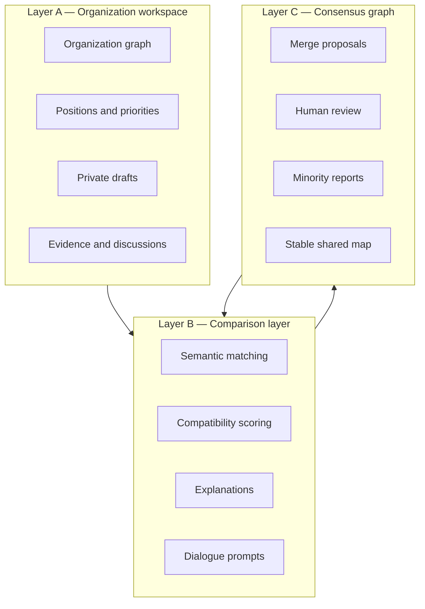

# Architecture

## Layered platform model

Politree should be designed as three tightly related but differently governed layers.

## Layer A — Organization workspace

This is the canonical home of an organization's knowledge graph.

Responsibilities:

- define principles, policy areas, and policies
- attach notes and evidence
- express stance and importance
- publish updates and news
- manage contributor roles

Design decision: each organization remains sovereign over its graph. This avoids premature standardization and reflects political reality.

Weakness: sovereign graphs increase comparison complexity and moderation cost. That is acceptable because forcing a single schema early would likely suppress legitimate political diversity.

## Layer B — Comparison layer

The comparison layer should compute candidate alignments between graphs and explain them.

Responsibilities:

- detect exact, approximate, and contested matches
- identify mismatches in structure and priority
- surface unaddressed topics
- produce compatibility explanations
- suggest discussion topics and possible coalitions

This layer should be computation-heavy but legitimacy-light: it suggests, it does not decide.

## Layer C — Consensus graph

The consensus graph is a public synthesis layer emerging from reviewed proposals.

Responsibilities:

- host shared nodes accepted by multiple organizations
- record minority formulations and dissent notes
- preserve proposal history and vote trails
- expose what is shared, not merely what is common in wording

This layer must evolve slowly. If it changes too easily, it becomes politically fragile and easy to capture.

## Service decomposition

Recommended platform services:

| Service | Main responsibilities |
| --- | --- |
| identity and verification | accounts, organization verification, role assignment |
| graph service | nodes, edges, revisions, positions |
| discussion service | typed conversations, summaries, moderation hooks |
| evidence service | notes, flags, review state |
| comparison service | matching, scoring, explanations |
| consensus workflow service | merge proposals, approvals, appeals |
| search and retrieval service | semantic search, faceting, graph traversal |
| audit and trust service | attribution, abuse monitoring, transparency logs |

## Data architecture assumptions

Recommended storage pattern:

- transactional store for canonical entities and permissions
- graph-oriented read model for traversal-heavy queries
- search index for full-text and semantic retrieval
- append-only event log or revision ledger for history and auditing

A single database can support a prototype, but production-scale comparison and semantic retrieval will likely require dedicated read models and asynchronous pipelines.

## Scalability considerations

### Thousands of organizations

Naive pairwise comparison scales poorly. The platform should:

- precompute embeddings for published nodes
- maintain candidate-match indexes by type and language
- compare incrementally after relevant revisions
- support organization cohorts instead of all-to-all comparison by default

### Millions of nodes

The main bottleneck will be semantic indexing and explanation generation, not raw storage.

Mitigations:

- separate publication from indexing
- batch recompute similarity windows
- cache accepted cross-organization mappings
- prioritize high-signal node types such as core values and major policy areas

### Large discussions

Unbounded threads become unusable. The design should include:

- typed discussion items
- moderator and AI-generated summaries
- stale thread collapsing
- issue-style proposal states

## Deployment posture

The first release should target a single multi-tenant hosted instance model. Federation is attractive in theory but too costly at the start because identity, moderation, and semantic consistency are already difficult in a central deployment.

Long-term, federation can be reconsidered once identity, exchange formats, and cross-instance trust protocols are mature.
