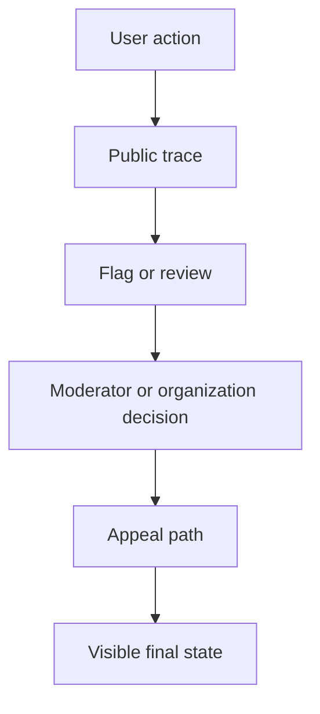

# Governance and trust

## Why governance is central

Politree is not just a publishing tool. It creates public interpretations of political proximity, evidence quality, and consensus. That makes governance part of the core product, not an administrative add-on.

## Why this matters

Without legitimacy features, the platform would quickly be seen as a scoring machine that hides politics behind interface decisions. Governance is how the system stays contestable and auditable.

## Organization verification

Recommended verification levels:

| Level | Meaning | Capabilities |
| --- | --- | --- |
| unverified | account exists but legitimacy unclear | limited publishing and no consensus voting |
| basic verified | identity and contact confirmed | full workspace participation |
| trusted public actor | recognized organization or institution | stronger reputation starting point |

Verification should reduce fraud, but it must not become a gatekeeping tool that excludes emergent movements. A tiered system is better than a binary badge.

## Roles and permissions

Minimum role model:

- instance administrator
- moderator
- organization administrator
- organization editor
- verified contributor
- public observer

Permission boundaries should apply separately to:

- graph editing
- evidence submission
- moderation actions
- merge proposal creation
- consensus approvals

## Evidence review and peer-review analogue

Evidence review should be inspired by scientific and collaborative moderation systems without copying any one of them.

### Comparison to scientific peer review

- Similarity: scrutiny of claims, provenance, and methodological quality
- Difference: evidence in politics is often mixed, normative, and context-dependent

### Comparison to Wikipedia

- Similarity: transparent revision history, public flags, collaborative curation
- Difference: Politree must preserve plural interpretations rather than converge on a single neutral article voice

### Comparison to Stack Overflow

- Similarity: signal ranking, reputation incentives, moderation tooling
- Difference: political reasoning is rarely reducible to one correct answer

### Comparison to open-source governance

- Similarity: proposals, maintainers, reviews, forks, merge decisions
- Difference: legitimacy depends on broader democratic participation, not only contributor expertise

## Evidence flagging workflow

1. a note is added with public attribution
2. other participants can flag it with typed reasons
3. flag counts and rationales are public
4. after threshold, the note becomes disabled or greyed out, not deleted
5. moderators review, uphold, or reverse the state
6. repeated low-quality submissions affect submitter reputation

Greying out is better than deletion because it preserves institutional memory and deters silent moderation abuse.

## Appeals and legitimacy

Every moderation or consensus action with material effect should support:

- a written rationale
- a visible decision trail
- a time-bounded appeal path
- role separation between initial action and appeal review when possible

Without appeals, moderation will quickly be interpreted as political capture.

## Anti-abuse mechanisms

Recommended controls:

- rate limits on node creation and evidence submission
- reputation-weighted but capped influence
- anomaly detection for synchronized flagging or voting
- mandatory cooling-off periods for high-impact merges
- organization-level sanctions for repeated manipulation

These measures help, but none solve coordinated capture by powerful actors. That risk must be treated as persistent and partly social rather than fully technical.

## Related decisions

- [Vision and principles](./vision-and-principles) explains why transparency and minority preservation are non-negotiable.
- [Comparison, consensus, and AI](./comparison-consensus-and-ai) explains which actions need review and appeal.
- [UX and operations](./ux-and-operations) explains how these controls should appear to users.

## How this affects implementation

The first releases should include verification tiers, typed moderation states, visible audit trails, and appealable decisions before adding more advanced public influence systems.

## Alternatives and later extensions

Later versions can add stronger reputation signals, deeper anti-brigading systems, and more specialized review bodies. Those should build on transparent base workflows rather than replace them.

## Next reading

- Continue to [UX and operations](./ux-and-operations) for user-facing workflows.
- Continue to [Roadmap, alternatives, and open questions](./risks-roadmap-and-open-questions) for long-term governance risks.
