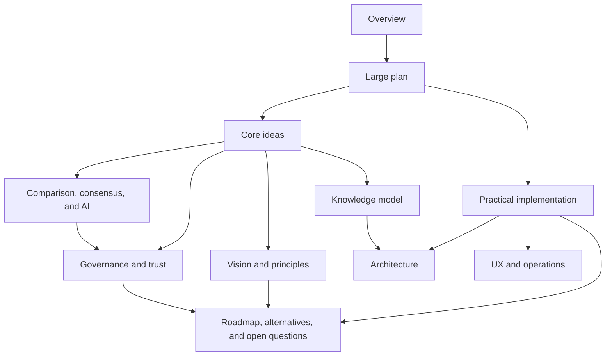

# Politree

> A documentation site for a platform that helps political organizations map agreement, disagreement, and possible coalition paths without hiding minority views.

## Start here

This site is now organized in four reading layers:

1. **Large plan** — what Politree is trying to become and why it matters
2. **Core ideas** — the product principles, knowledge model, comparison logic, and governance model
3. **Practical implementation** — what to build first, what to defer, and what trade-offs to accept
4. **Later options** — alternative designs, scaling questions, and open risks

## Documentation map

## What problem Politree is solving

Political programs are usually published as flat texts, campaign promises, and disconnected debates. That makes it hard to answer a few practical questions:

- which ideas are already shared across organizations?
- which disagreements are semantic, structural, or substantive?
- which policies conflict with stated values?
- which coalitions are plausible without flattening dissent?

Politree proposes a different model: represent political thought as structured, versioned knowledge that can be compared, discussed, and cautiously merged.

## Reading paths

| If you want to understand... | Start here | Then continue with... |
| --- | --- | --- |
| the end-state vision | [Large plan](./large-plan) | [Vision and principles](./vision-and-principles), [Roadmap, alternatives, and open questions](./risks-roadmap-and-open-questions) |
| the conceptual model | [Vision and principles](./vision-and-principles) | [Knowledge model](./knowledge-model), [Comparison, consensus, and AI](./comparison-consensus-and-ai) |
| how this could be built | [Practical implementation](./practical-implementation) | [Architecture](./architecture), [UX and operations](./ux-and-operations) |
| governance and legitimacy | [Governance and trust](./governance-and-trust) | [Comparison, consensus, and AI](./comparison-consensus-and-ai), [Roadmap, alternatives, and open questions](./risks-roadmap-and-open-questions) |

## Core promises

Politree should:

- publish a canonical knowledge graph of an organization's positions
- compare that graph with others
- preserve evidence and disagreement next to each idea
- support coalition exploration without erasing minority views
- evolve a slower, community-governed consensus graph

Politree should **not**:

- decide which political positions are correct
- automatically merge positions through AI
- optimize for engagement over understanding
- flatten disagreement into a single number
- replace democratic processes inside participating organizations

## Big-picture guide

- Read [Large plan](./large-plan) for the full narrative and major phases.
- Read [Vision and principles](./vision-and-principles) for the philosophical foundation.
- Read [Knowledge model](./knowledge-model) for the data structures and semantics.
- Read [Practical implementation](./practical-implementation) for what to build now versus later.
- Read [Roadmap, alternatives, and open questions](./risks-roadmap-and-open-questions) for deferred complexity and unresolved design choices.
