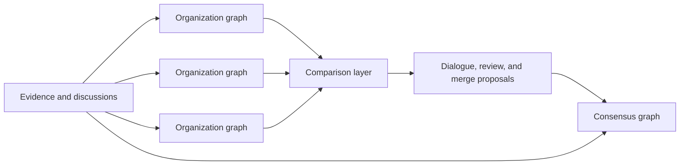

# Politree

> First official design document for an open-source platform that helps political organizations understand agreement, disagreement, and paths toward convergence.

## Status

This document is intentionally ambitious and intentionally critical. It treats the project as a socio-technical system, not just a graph database with a discussion layer.

## Problem statement

Political programs are usually published as flat texts, press releases, and campaign materials. That makes it hard to answer basic coordination questions:

- Which ideas are already shared across organizations?
- Which disagreements are semantic, structural, or substantive?
- Which policies conflict with stated values?
- Which coalitions are plausible without forcing artificial uniformity?

Politree proposes a different model: represent political thought as structured, versioned knowledge that can be compared, discussed, and cautiously merged.

## Vision

Politree should help organizations:

- publish a canonical knowledge graph of their positions
- compare that graph with others
- preserve evidence and disagreement next to each idea
- explore coalition opportunities without erasing minority views
- evolve a slower, community-governed consensus graph

## Non-goals

Politree should **not**:

- decide which political positions are correct
- automatically merge positions through AI
- optimize for engagement over understanding
- flatten principled disagreement into a single compatibility number
- replace internal democratic processes of participating organizations

## Design axioms

1. **Neutral software, contextual instances.** The platform itself should remain politically neutral, even if an instance serves a specific political family.
2. **Agreement discovery over opinion homogenization.** The goal is visibility and negotiation, not ideological compression.
3. **Evidence informs politics; it does not mechanically settle it.**
4. **Human validation is required for semantic and structural change.**
5. **Minority positions must remain visible after coalition-building.**
6. **Governance is a product feature, not an afterthought.**

## Conceptual model

## Why a graph instead of a document

The tree-like interface is useful for navigation, but the underlying model should be a directed graph:

- one idea can belong to multiple thematic branches
- the same policy may be justified by different values
- supporting evidence may connect to many nodes
- conflicts and alternatives are often cross-cutting rather than hierarchical

The main trade-off is usability. Graphs are more expressive than documents, but they are also harder to govern, compare, and explain. Politree should therefore expose tree views, filtered maps, and scoped discussions on top of a graph model rather than showing a raw graph everywhere.

## Core tensions

The project must continuously manage these tensions:

| Tension | Why it matters | Design response |
| --- | --- | --- |
| openness vs manipulation resistance | public systems attract spam, brigading, and identity fraud | verification, rate limits, reputation, appeals |
| semantic flexibility vs comparability | natural language is expressive but ambiguous | canonical node types, explanations, human review |
| convergence vs minority preservation | coalitions need synthesis, democracy needs dissent | layered positions, minority reports, forkable proposals |
| AI assistance vs human legitimacy | automation scales, but legitimacy requires accountability | AI suggestions only, never automatic authority |
| transparency vs cognitive overload | traceability is valuable, but too much detail reduces participation | progressive disclosure, summaries, role-aware views |

## Reading guide

- Start with [Vision and principles](./vision-and-principles) for the philosophical foundation.
- Read [Knowledge model](./knowledge-model) for data structures and semantics.
- Read [Architecture](./architecture) for system layers and scaling assumptions.
- Read [Comparison, consensus, and AI](./comparison-consensus-and-ai) for matching, scoring, and review workflows.
- Read [Governance and trust](./governance-and-trust) for moderation and legitimacy.
- Read [UX and operations](./ux-and-operations) for user journeys and product behavior.
- Read [Risks, roadmap, and open questions](./risks-roadmap-and-open-questions) for failure modes and unresolved decisions.
