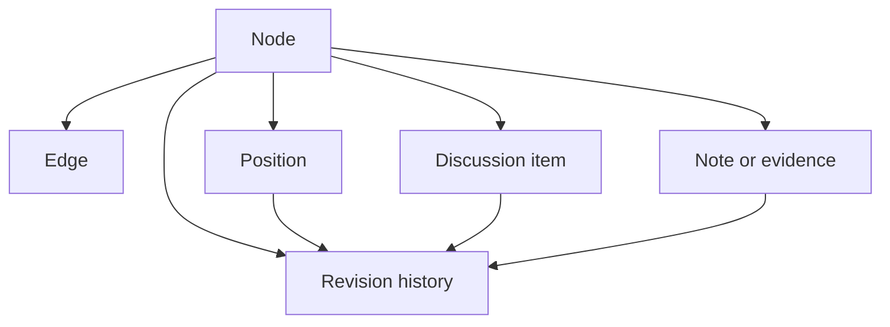

# Knowledge model

## Core model

The internal representation should be a typed directed graph.

## Why this matters

The knowledge model is what makes the rest of the project possible. Without explicit entities and relations, Politree would fall back to a document archive with weak comparison and weak accountability.

## Primary entities

| Entity | Description | Notes |
| --- | --- | --- |
| node | a value, policy area, concrete policy, or historical root | canonical content object |
| edge | semantic relation between nodes | supports many-to-many structure |
| note | external evidence metadata with optional local summary | not ideological by itself |
| discussion item | argument, question, proposal, objection, summary | scoped to a node or note |
| position | an organization's stance on a node | support, oppose, mixed, under review, not addressed |
| revision | immutable historical snapshot of a change | enables diffs and rollback |
| merge proposal | human-reviewed proposal to align, split, or merge nodes | required for consensus evolution |

## Node types

Required top-level node types:

- `historical_root`
- `core_value`
- `policy_area`
- `policy`

Recommended secondary semantic tags:

- governance
- economy
- labor
- ecology
- rights
- public services
- migration
- international relations

The trade-off is between simplicity and expressiveness. Too few types make comparison vague; too many types create taxonomy fatigue. Four primary types are enough for the first official model, with extensible tags for nuance.

## Edge types

Minimum viable edge taxonomy:

| Edge type | Meaning |
| --- | --- |
| `belongs_to` | navigational or thematic placement |
| `supports` | one node reinforces another |
| `depends_on` | one node presupposes another |
| `conflicts_with` | tension or contradiction |
| `refines` | narrower or more operational version |
| `related_to` | meaningful but weaker relation |
| `derived_from` | historical or conceptual origin |
| `alternative_to` | competing strategy toward similar goal |

Raw flexibility is dangerous here. Allowing arbitrary relations too early would make comparison noisy and AI explanations weak. The first release should keep a constrained edge vocabulary.

## Organization-specific overlays

Each organization should own:

- its canonical node wording
- node ordering and branch layout
- its positions and importance weights
- private drafts before publication
- contributor permissions

Organizations should not be forced to adopt the consensus graph structure. Instead, comparisons should map between independent graphs.

## Node record schema

Suggested minimum fields:

| Field | Purpose |
| --- | --- |
| stable identifier | persistent reference independent of wording |
| title | short human-readable label |
| summary | one-paragraph explanation |
| type | primary knowledge layer |
| tags | optional thematic labels |
| status | draft, published, archived, under review |
| parents | zero or more parent links |
| related nodes | semantic connections |
| source provenance | who created it and why |
| revision metadata | timestamps and edit history |

## Notes / evidence schema

Each note should preserve metadata even if the external resource disappears:

| Field | Required | Purpose |
| --- | --- | --- |
| title | yes | identify resource |
| short description | yes | explain relevance |
| external URL | yes | locate source |
| author | yes | accountability |
| publication date | yes | recency checks |
| source type | yes | paper, law, report, article, book, decision, review |
| archival status | recommended | record if URL still resolves |
| added by | yes | provenance |
| flags | derived | moderation state |

The system should optionally support snapshots or archived copies later, but the first design should avoid bundling large copyrighted materials into the platform by default.

## Discussion model

Every node and note should support scoped discussion objects:

- arguments
- counterarguments
- questions
- rewrite proposals
- evidence challenges
- summaries

Threading alone is insufficient. Discussions should be typed so users can filter for decision-relevant material.

## Version control concepts

Politree should borrow from Git conceptually without pretending political knowledge is software code.

| Git-inspired concept | Politree equivalent |
| --- | --- |
| commit | revision |
| branch | draft line of development |
| fork | organization-specific alternative or minority branch |
| pull request | merge proposal |
| diff | wording, structure, and stance comparison |
| merge conflict | incompatible semantics or incompatible positions |
| revert | rollback to prior accepted revision |

The analogy is useful for traceability, but dangerous if taken too literally. Political statements are ambiguous, contextual, and negotiated. The system should expose Git-like affordances without assuming purely deterministic merges.

## Related decisions

- [Vision and principles](./vision-and-principles) explains why the model must preserve disagreement and provenance.
- [Architecture](./architecture) explains which services must support this model.
- [Comparison, consensus, and AI](./comparison-consensus-and-ai) explains how the model is used for alignment and synthesis.

## How this affects implementation

For an MVP, the model should stay constrained:

- few node types
- few edge types
- typed discussions
- explicit revision metadata
- organization-specific overlays instead of a forced global schema

## Alternatives and later extensions

Later versions could support broader ontologies, stronger archival storage, and more flexible relation vocabularies. Those should come only after the constrained model proves readable and comparable.

## Next reading

- Continue to [Architecture](./architecture) for the supporting system design.
- Continue to [Comparison, consensus, and AI](./comparison-consensus-and-ai) for how this model is used in practice.
