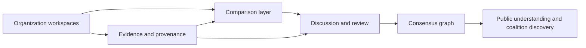

# Large plan

## The end-state Politree is aiming for

Politree should become a public knowledge infrastructure for political comparison.

The long-term goal is not merely to store programs. The goal is to make political positions:

- structured enough to compare
- traceable enough to audit
- social enough to debate
- careful enough to preserve disagreement
- governable enough to resist capture

## System-wide picture

## The large plan in four moves

### 1. Structure political knowledge

Each organization needs a canonical workspace where values, policy areas, policies, evidence, and revisions can be represented as linked knowledge rather than flat prose.

### 2. Compare organizations without pretending sameness

The platform should identify overlap, mismatch, ambiguity, and real conflict. Comparison is useful only if it remains explanation-first and reviewable.

### 3. Build consensus slowly

Shared synthesis should emerge from proposals, debate, endorsements, objections, and visible minority branches. Consensus must be a product layer, not an automatic output.

### 4. Preserve legitimacy as the system scales

Governance, moderation, verification, and appeals are not operational details. They are part of whether the product remains credible.

## Why this matters

Most political tooling is optimized either for publication or for campaigning. Politree instead tries to support understanding, comparison, and coalition-building. That requires a clearer relationship between data model, governance, and user experience than a normal documentation site or issue tracker would need.

## Related decisions

- [Vision and principles](./vision-and-principles) explains why minority preservation and slow consensus are central.
- [Knowledge model](./knowledge-model) explains what entities must exist for the plan to be possible.
- [Comparison, consensus, and AI](./comparison-consensus-and-ai) explains how comparison and synthesis should work.
- [Governance and trust](./governance-and-trust) explains why legitimacy features are part of the product core.

## How this affects implementation

The implementation should follow the same order as the plan:

1. get organization workspaces right
2. add explainable comparison
3. add review-heavy consensus workflows
4. add reputation, multilingual, and scale features later

For the concrete build sequence, continue with [Practical implementation](./practical-implementation).

## Alternatives and later extensions

- A document-first system would be simpler at first but much weaker for comparison.
- A federation-first design would be appealing politically but too expensive operationally at the start.
- AI-first consensus generation would move faster but would damage legitimacy.

## Next reading

- Continue to [Practical implementation](./practical-implementation) for the delivery path.
- Go deeper into [Vision and principles](./vision-and-principles) for the product thesis.
