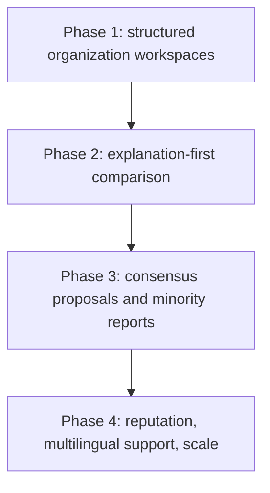

# Practical implementation

## What to build now

The first versions of Politree should aim for clarity, traceability, and good human review rather than ambitious automation.

## Practical delivery path

### Phase 1 — Foundation now

Build the parts that let one organization create trustworthy structured content:

- typed graph model
- notes and evidence metadata
- revision history
- scoped discussions
- publication states and roles

### Phase 2 — Comparison next

Add comparison only when the underlying content is stable enough to compare:

- exact and semantic candidate matching
- explanation-first result pages
- confidence and mismatch visibility
- importance-aware topic gaps

### Phase 3 — Consensus later

Consensus should be introduced only after comparison results are understandable:

- merge proposals
- endorsements, objections, and thresholds
- minority reports
- public decision history

### Phase 4 — Scale carefully

Only after the basics are credible should the platform expand into:

- reputation systems
- multilingual comparison layers
- AI debate summaries
- larger indexing and recommendation controls

## What this means in practice

| Area | Build now | Accept later |
| --- | --- | --- |
| data model | constrained node and edge types | broader ontology and more nuanced relations |
| comparison | explainable matching with human review | richer automation and ranking |
| governance | verification, roles, flags, appeals | advanced reputation and anti-brigading systems |
| UX | progressive disclosure and readable summaries | richer graph exploration and saved expert views |
| infrastructure | single hosted instance | federation and heavy distribution |

## Alternative implementation paths

### Document-first prototype

This would be faster to ship but weaker for comparison and link structure. It is useful only if the goal is to validate editorial workflows before graph semantics.

### Comparison-first prototype

This would look exciting quickly, but without disciplined source data it would generate shallow or misleading results.

### Federation-first prototype

This fits the political ethos of autonomy, but it adds major identity, moderation, and interoperability complexity too early.

## What can wait until later

- fully flexible ontology design
- broad federation support
- high-automation AI workflows
- sophisticated public reputation markets
- strong recommendation features

## Related decisions

- [Architecture](./architecture) details the service boundaries implied by this sequence.
- [UX and operations](./ux-and-operations) shows the product behaviors needed to make these phases usable.
- [Roadmap, alternatives, and open questions](./risks-roadmap-and-open-questions) collects the deferred complexity and unresolved choices.

## Next reading

- Continue to [Architecture](./architecture) for system structure.
- Continue to [UX and operations](./ux-and-operations) for the user-facing consequences.
