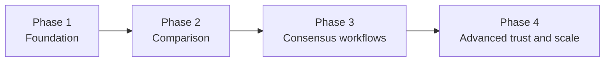

# Roadmap, alternatives, and open questions

## Why this page exists

This page collects the parts of the design that should stay visible but should not be forced into the first implementation. It is the bridge between the large plan and the practical roadmap.

## Phased roadmap

## Major risks

### Echo chambers

Organizations may use the platform only to compare with ideologically adjacent actors, reinforcing existing blocs.

**Mitigation:** encourage cross-cluster exploration, show topic-level bridges, and avoid recommendation loops based only on prior affinity.

### Political capture

A dominant coalition could shape taxonomy, moderation norms, or consensus thresholds to disadvantage minority actors.

**Mitigation:** transparent governance, plural moderator composition, appeals, and visible minority branches.

### Semantic ambiguity

Political language is famously overloaded. Terms such as freedom, security, reform, and sovereignty can hide major differences.

**Mitigation:** explanation-first matching, node summaries, historical provenance, and mandatory human validation for important alignments.

### AI bias

Models may privilege mainstream vocabulary, dominant-language corpora, or region-specific assumptions.

**Mitigation:** benchmark sets, bias review, model version traceability, and explicit user challenge flows.

### Gaming compatibility scores

Actors may strategically phrase values broadly to appear aligned while hiding concrete divergence.

**Mitigation:** expose policy alignment separately, penalize unexplained vagueness, and highlight critical conflicts.

### Fake organizations

Bad actors can create shell groups to influence scores, evidence review, or consensus proposals.

**Mitigation:** tiered verification, reputation gating, and reduced voting power for newly created or low-trust organizations.

### Citation spam

Users may flood nodes with weak or repetitive sources to simulate legitimacy.

**Mitigation:** note deduplication, source diversity indicators, flagging, quotas, and moderator review.

### Information overload

Even a well-structured system can become unreadable at scale.

**Mitigation:** progressive disclosure, summaries, topic scoping, saved views, and relevance ranking.

### Moderation abuse

Public moderation powers can themselves become instruments of politics.

**Mitigation:** public rationale, audit logs, appeals, and reversible actions such as disabling instead of deleting.

### Consensus pressure

Users may treat the consensus graph as the only legitimate output and silence uncomfortable disagreement.

**Mitigation:** strong non-goal messaging, visible dissent paths, and explicit minority reports.

### Loss of minority opinions

Over time, even without malicious intent, synthesis workflows tend to compress nuance.

**Mitigation:** preserve forks, attach minority formulations to merged nodes, and require discussion summaries to mention unresolved objections.

## Recommended implementation roadmap

### Phase 1 — Foundation

- organization workspaces
- typed graph model
- notes and evidence metadata
- revision history
- scoped discussions

### Phase 2 — Comparison

- exact and semantic candidate matching
- explanation-first comparison views
- compatibility bands
- importance-aware topic gap analysis

### Phase 3 — Consensus workflows

- merge proposals
- endorsements, objections, and thresholds
- minority reports
- public decision history

### Phase 4 — Advanced trust and scale

- reputation and anti-brigading systems
- multilingual support
- AI debate summaries and contradiction detection
- large-scale indexing and recommendation controls

## Alternative paths

### Simpler near-term option

Stay focused on organization workspaces plus read-only comparison reports before attempting consensus workflows.

### More ambitious near-term option

Introduce merge proposals early, but only for a narrow subset of high-level shared values rather than for detailed policy nodes.

### Deferred long-term option

Revisit federation only after identity, moderation, and exchange formats are stable enough to survive cross-instance politics.

## Open questions

1. Should consensus approvals be one-organization-one-vote, reputation-weighted, or topic-specific?
2. How should the platform represent conditional support, such as "support if paired with labor safeguards"?
3. Should value conflicts be modeled separately from implementation conflicts?
4. How much private drafting should organizations retain before publication pressures undermine transparency goals?
5. At what point, if any, does federation become worth the governance complexity?
6. What legal and archival posture should the platform adopt for external materials that disappear or are contested?

## Final assessment

The project is promising because it treats political programs as living knowledge rather than static slogans. Its hardest problems are not frontend rendering or graph traversal, but legitimacy, ambiguity, and abuse resistance.

The safest product strategy is to start narrow:

- strong organization workspaces
- careful comparison with good explanations
- slow, review-heavy consensus workflows

If Politree tries to automate consensus too early, it will likely lose both trust and usefulness. If it stays disciplined about human validation, traceability, and dissent preservation, it could become a meaningful public infrastructure for coalition-building.

## Related decisions

- [Large plan](./large-plan) explains the overall destination.
- [Practical implementation](./practical-implementation) explains the preferred delivery sequence.
- [Governance and trust](./governance-and-trust) explains why many of these risks are political, not only technical.

## Next reading

- Return to [Overview](./index) for the full site map.
- Revisit [Practical implementation](./practical-implementation) when turning this document into delivery milestones.
